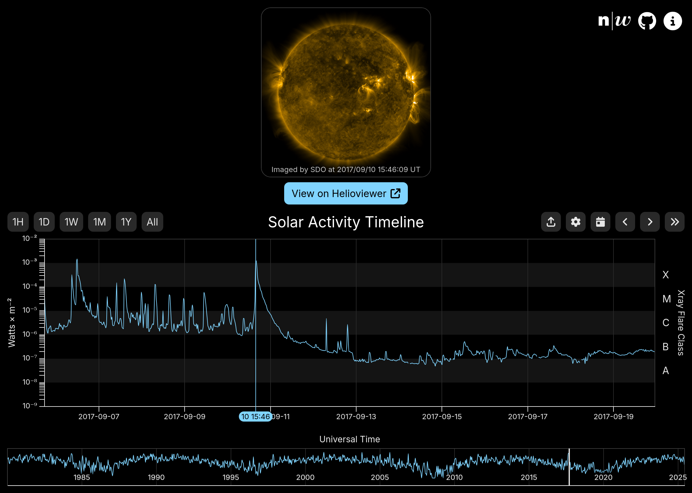

# Heliotime ([heliotime.org](https://heliotime.org/))

Interactive web viewer of [GOES X-ray Flux](https://www.swpc.noaa.gov/products/goes-x-ray-flux) data from 1980 to now. Lets you inspect specific solar flares, the different solar cycles, or any other time range of your choosing. Includes a preview of [Helioviewer](https://helioviewer.org/?imageLayers=[SDO%2CAIA%2CAIA%2C171%2C1%2C100]) when selecting a timestamp. See [heliotime.org](https://heliotime.org/) or the [screenshots](#screenshot).

## Getting started

First, this repository uses Git submodules, so ensure they are properly initialized:

```sh
git submodule init 
git submodule update
```

Run the following command to deploy the development Docker Compose configuration:

```sh
./du.sh dev deploy
```

This will run everything in Docker and make the site available at:

- <http://localhost:3000/>

For development it is easier to run the individual services on the host. Check out the readmes ([Server](./server/README.md), [Site](./site/README.md)) in the respective subdirectories.

For the database, here are some useful commands:

```sh
# Start only the database
./du.sh dev deploy db

# Reset the database (wipes all data)
./du.sh dev db:reset
```

> **Docker Utility** <br>
> `du.sh` is an alias to `docker compose` which loads the right compose files depending on the selected environment:
> development `dev` or production `prod`. Only production requires certain environment variables to be set.
> See [Configuration](#configuration) for available options.

## Deployment

See [deployment](./docs/deploy.md) on how to deploy Heliotime in production.

## Configuration

The Docker Compose deployment, site, and server can be configured using the following environment variables:

| <div style="width:150px">Name</div> |       Dev Default       | Prod Default | Description                                                                                   |
| :---------------------------------: | :---------------------: | :----------: | :-------------------------------------------------------------------------------------------- |
|             `API_PORT`              |         `8000`          |     same     | Port the api (server) will be exposed at.                                                     |
|             `SITE_PORT`             |         `3000`          |     same     | Port the site will be exposed at.                                                             |
|      `EXTERNAL_DATABASE_PORT`       |         `5432`          |     same     | Port the database will be exposed at.                                                         |
|           `DATABASE_HOST`           |   `db` / `localhost`    |     same     | Hostname of the database. (Docker / Host)                                                     |
|           `DATABASE_PORT`           |         `5432`          |     same     | Port of the database. (useful for external DBs)                                               |
|         `DATABASE_DATABASE`         |       `postgres`        |     same     | Name of the database to use.                                                                  |
|         `DATABASE_USERNAME`         |       `postgres`        |     same     | Username to authenticate with the database.                                                   |
|         `DATABASE_PASSWORD`         |       `heliotime`       |      -       | Password to authenticate with the database.                                                   |
|        `DATABASE_MEMORY_GB`         |          `28`           |     same     | GB of memory available to the database. Used by migrations to optimize chunk and cache sizes. |
|           `IMPORT_START`            |      now - 30 days      |     same     | From when to import data in ISO format.                                                       |
|        `FLUX_MAX_RESOLUTION`        |         `2000`          |     same     | Max flux resolution allowed to be requested. Bigger request will be downsized.                |
|        `FLUX_QUERY_TIMEOUT`         |          `30`           |     same     | Timeout of flux database queries before giving up.                                            |
|        `NEXT_PUBLIC_API_URL`        | `http://localhost:8000` |     same     | URL used by the browser to access the API.                                                    |

Docker Compose automatically loads `.env` in the repository root and the site (Next.js) does the same for `site/.env.local` when running on the host.

## Screenshot


